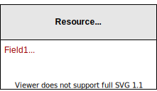
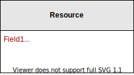

# The Disableable concept

Disableable resources cannot be deleted (with some exceptions) because doing so may destroy history and thus inferere with audits. Instead, these resources can merely be _disabled_ so that they no longer have any effect on system behavior.

For example, if a User exists then that means that a person can login using that identity. By disabling that User, login is no longer permitted.

The Disableable concept is a superset of the [Undeletable concept](undeletable-concept.md). All Disableable resources are also Undeletable, but the reverse is not always true.

## Infrastructure & implementation

Disableable resources have an implicit `Enabled` boolean field. So the above is actually:

## Behavior

A Disabled resource commonly behaves as follows:

 * It can be re-enabled.
 * It's temporarily partially immutable. It's only partially immutable when it's disabled. When disabled, all fields except for `Enabled` are immutable.
 * It doesn't show up in lists by default. For example, when listing all users, we by default only show enabled users.

## Scope & real deletion

Just like with the Undeletable concept, Disableable resources have a scope. Only when that scope is deleted, will a Disableable resource be truly deleted. Otherwise, Disableable resources can merely be disabled.

## Foreign key constraints

Resources that reference a disableable resource, use the foreign key constraint `ON DELETE RESTRICT` to prevent accidental data deletion.

## When combined with Reviewable

See the [Reviewable concept's documentation](reviewable-concept.md#when-combined-with-undeletable-or-disableable) to learn what it means to combine Disableable and Reviewable.

## See also

 * [The Undeletable concept](undeletable-concept.md)
