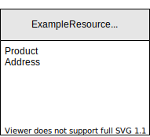
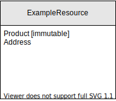
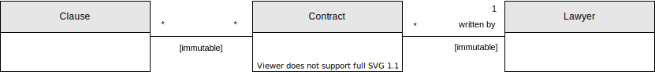
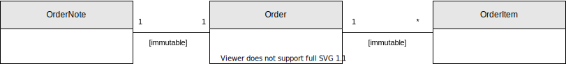
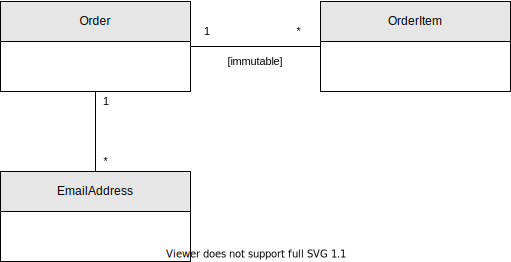

# The Immutability concept

Some resources in the data model are immutable. Immutability is a tricky concept, because one needs to ask *what* is immutable. This document provides guidance on, and language for, defining immutability more precisely. It also defines how immutability should be indicated in diagrams.

Immutability has 3 orthogonal aspects:

 * Location: immutable fields vs immutable relationships
 * Quantity: how much is immutable?
 * Time: when does a resource become immutable?

## Location aspect: immutable fields vs immutable relationships

Immutability can mean **immutable fields** or **immutable relationships**. They are not mutually exclusive: a resource can have both immutable fields and immutable relationships.

### Immutable fields

How immutable fields are indicated in diagrams depends on their [immutability quantity](#quantity-aspect-how-much-is-immutable):

 * A resource with [fully immutable fields](#quantity-aspect-how-much-is-immutable) has the "[immutable]" annotation on the resource.

   

 * A resource with [partially immutable fields](#quantity-aspect-how-much-is-immutable) has the "[immutable]" annotations on immutable fields. All fields without this annotation are considered mutable.

   

   In the above example, only the Product field is immutable. The Address field is mutable.

### Immutable relationships

An immutable relationship means that, once the initial relations are established, no relations may be added, removed or replaced. An immutable relationship is indicated in diagrams with the "[immutable]" annotation on the relationship.

Immutability on a relationship is **directional**. An "[immutable]" annotation in the center of the relationship line means that both directions are immutable. An annotation on one side means that only that direction is immutable.

Example:

 * Contract _has a bidirectional immutable relationship with_ Clause. Once a the system has defined Contracts and their Clauses, no Contracts may be added/removed for any given Clause, and no Clause may be added/removed for any given Contract.
 * Contract _has a unidirectional immutable relationship with_ Lawyer.
    - The Contract -> Lawyer relationship is immutable: once a Contract is made, its Author is permanent. A Contract cannot suddenly become written by a different Lawyer.
    - The Lawyer -> Contract relationship is mutable. A Lawyer can always write new Contracts, be s/he cannot use Clauses that have appeared in existing Contracts.

## Quantity aspect: how much is immutable?

There are 3 terms to indicate how much is mutable:

 * **Mutable** indicates that nothing is immutable.
 * **Fully immutable** indicates that everything is immutable.
 * **Partially immutable** indicates that only some things are immutable. One must document which things are mutable, and which things are immutable.

### When applied on resources/fields

 * A "mutable resource" is just a normal resource.

 * A "fully immutable resource" is one where all its fields are immutable. It has the "[immutable]" annotation on the resource.

   

 * A "partially immutable resource" is one where some of its fields are immutable. It has the "[immutable]" annotations on immutable fields. All fields without this annotation are considered mutable.

   

   In the above example, only the Product field is immutable. The Address field is mutable.

### When applied on relationships

 * A resource "with mutable relationships" is just a resource with normal relationships.

 * A resource "with fully immutable relationships" means all its relationships are immutable.

   

   In the above example, Order has fully immutable relationships, because both its relationship with OrderNote and its relationship with OrderItem are immutable.

 * A resource "with partially immutable relationships" means only some (but not all) of its relationships are immutable.

   

   In the above example, Order has partially mutable relationships, because only its relationship with OrderItem is immutable. Its relationship with EmailAddress is mutable.

## Time aspect: when does a resource become immutable?

Normally, immutability means that something is always immutable. But sometimes, something may start as mutable and then become immutable once a condition is reached. A time quantifier should be used to describe a time aspect.

 * When no time quantifier is used, it means that something is always immutable. "A is partially immutable" means the same as "A is always partially immutable".

 * **Initially immutable** indicates that something is immutable in its initial condition.

 * **Eventually immutable** indicates that once a condition is reached, something becomes _permanently_ immutable. This implies that the condition will always stay applicable, once reached. The diagram should document what this condition is.

   The [major version resource](reviewable-concept.md#major-and-minor-versions) in the [Reviewable concept](reviewable-concept.md) is an example of an **eventually fully immutable resource**, with an **eventually immutable relationship** with the minor version resource.

    - Before the major version is approved, new minor versions may be added at will, and the major version object's number is mutable.
    - Once the major version is approved, it cannot become unapproved again. On approval, a number is permanently assigned to the major version object, and no new minor versions may be added.

      The number is the only field in the major version resource that isn't always-immutable, so once a permanent number is assigned, the major version object becomes permanently immutable.

 * **Temporarily immutable** indicates that once a condition is reached, something is only immutable until the condition no longer applies. The diagram should document what this condition is.

   In case of immutibility on resources (instead of relationships), temporary immutibility implies that the fields on which the condition is based are mutable.

   [Disableable resources](disableable-resources.md) are good examples of temporary immutable resources. Whether a resource is enabled is indicated by an `Enabled` boolean field.

    - When enabled, the resource is either partially immutable, or not immutable. It's never fully immutable because the `Enabled` value may change. And that's because disableable resources are merely temporarily immutable, not eventually immutable.
    - When disabled, the resource is also either partially immutable, or not immutable.
       - It may be partially immutable because you usually don't want a disabled resource's contents to change.
       - It's never fully immutable because the `Enabled` value may change. And that's because disableable resources are merely temporarily immutable, not eventually immutable.

## Deletability

Immutability has got nothing to do with whether an object may be deleted. Immutable resources are normally deletable, except when it's declared [Undeletable](undeletable-resources.md).
