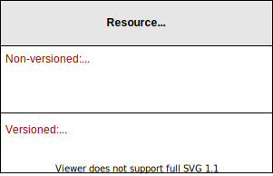
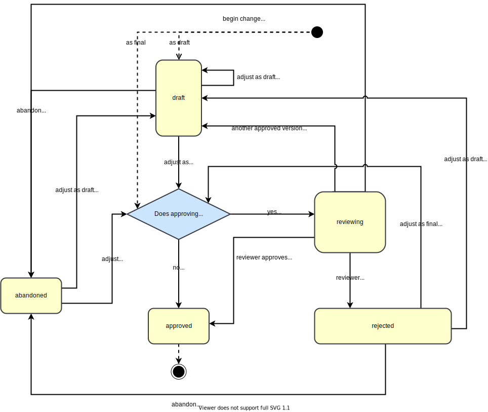
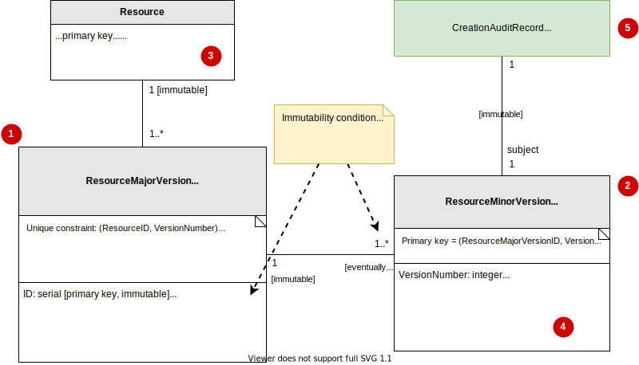
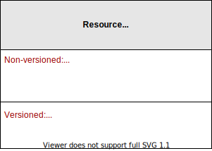
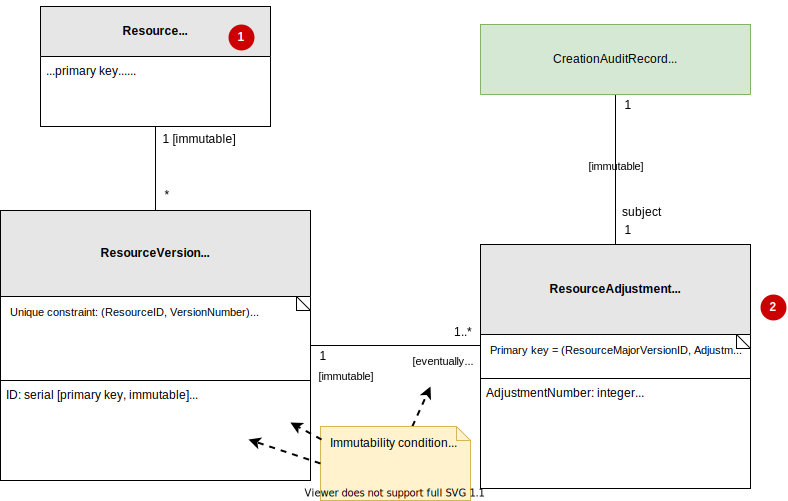

# The Reviewable concept: versioning, auditing & reviewing changes

The Reviewable concept is an approach that covers:

 - **Versioning**: recording all past versions of a resources.
 - **Auditing**: finding out why a resource changed, and who were responsible.
 - **Reviewing**: new changes are reviewed before they take effect.

These aspects are important for many resource types. You don't want ruleset changes to take effect until the change management board has reviewed them. If a production incident occurred, you want to be able to find out which change contributed to that problem, and why that change was made.

In diagrams, reviewable resources are annotated with "[reviewable]":

This document covers how this concept works, how it's used in diagrams, how it's implemented in the database and how it's implemented in the code.

## Versions & adjustments

Reviewable resources are _versioned_. One does not modify the contents of a reviewable resource in-place. Instead, one creates a new version. Older versions are immutable. With this approach, all modification history is preserved.

Only the latest approved version of a resource has effect on the system. All older versions exist only for the purpose of historical analysis.

Creating a version is a process that happens in multiple steps. It may involve multiple revisions of the content, as well as reviews and approvals. We call each step in the creation of a version, an _adjustment_. By tracking all adjustments, we know who collaborated in the creation of a version and how they made decisions.

## Terminology

 * Version — Either an approved version, or a proposal.
 * Adjustment
 * Version creation process
 * Approved version
 * Proposal (a.k.a. proposed version)

## The version creation process

The version creation process follows this flow:

 * When a creation process begins, the system creates a new _version_ of the resource. This version is no yet approved, and thus has no version number yet. We say that this new version is a _proposal_.
 * The proposal may start in the draft state, which means that it isn't ready for review. This draft can be revised multiple times, each time perhaps by a different author. Once someone decides it's ready, s/he finalizes the proposal. It's then ready for review.
 * The system first automatically determines whether the proposal may result in a relevant change system behavior. If not (for example, when creating a new Ruleset which isn't bound to any Applications), then the system automatically approves the proposal.
 * If the system determines that a manual review is necessary, then the system changes the proposal to the "reviewing" state and awaits a review.
 * Multiple parallel proposals may exist simultaneously. If during the reviewing state, some *other* proposal of the same resource is approved, then the system automatically changes our proposal back to the "draft" state, in order to prevent a reviewer from approving a proposal that's out-of-date with the latest reality.
 * If a reviewer rejects the proposal, then the proposal transitions to the "rejected" state. Someone can then decide to revise the proposal, either as draft, or as final (which immediately pushes the proposal into the review process again).
 * At any time (except when the version is approved) an authorized organization member may abandon this proposal. In the abandoned state, someone may reopen (revise) the proposal, either as draft or as final.
 * The version creation process ends upon approval. We say that the proposal has become a _approved version_. The system assigns a version number to the version object.

Any of the above events are steps in the version creation process. Each step results in the creation of a new _adjustment_.

## Proposal is temporary, approval is forever

A proposal can be deleted at any time.

Once a proposal becomes an approved version, then it remains an approved version forever. An approved version is never deleted (unless the reviewable resource is deleted in its entirety).

## Version and adjustment numbers

Versions and adjustments have numbers. These numbers are monotonically increasing, starting from 1.

A version's number could be null. A null number means that that version is a proposal. Approved versions always have a number.

## Infrastructure & implementation

### Common case

A Reviewable resource is usually displayed in diagrams through its _simple notation_, with all its infrastructure hidden:

The simple notation actually represents the following infrastructure:

Highlights:

 * (1): A Resource is backed by multiple Versions.
 * (2): Each Version is backed by one or more Adjustments.
 * (1) and (4): A Version contains very little information. It mainly exists to group Adjustments together. This is why a Version has at least one Adjustment: the versioned content is stored inside the Adjustment.
 * (3) and (4): The Resource's primary key, as well as its non-versioned fields, are located in the Resource itself. However, its versioned fields live in the Adjustment instead.
 * (5) Each Adjustment has exactly one CreationAuditRecord. This keeps track of who made this Adjustment.

### When combined with Undeletable or Disableable

Suppose that a Reviewable resource is [Undeletable](undeletable-concept.md) or [Disableable](disableable-concept.md), like this:

Here's what it means for the underlying infrastructure:

Here are the changes compared to the common case:

 1. The Resource itself is always Undeletable, even if the simple notation says its Disableable. The scope is the same as it says in the simple notation.
 2. The Adjustment resource is also Disableable or Undeletable, just like the simple notation says. The scope however is ResourceVersion, not X.

If the Resource is Disableable, then:

 * The `Enabled` flag lives inside the Adjustment.
 * Enabling/disabling the resource results in a new adjustment. This is because the immutability property also extends to the Disableable concept's implicit `Enabled` flag.

## Assocations

TODO: what happens if the simple notation has associations? there are two possibilities: associations on the Resource itself, or associations on the adjustments (which means associations are also versioned).

## Version and Adjustment object immutability

> See also: [The Immutability concept](immutability.md)

A Version is initially partially immutable, eventually fully immutable, and has eventually fully immutable relationships:

 * When a version is not yet approved, its version number is null. In this state it's partially immutable: all fields besides `VersionNumber` are immutable.

 * When a version is approved, its version number becomes permanently non-null. In this state:

     - It's fully immutable.
     - It has fully immutable relationships. No more adjustments may be added.

Adjustments are always fully immutable, and always have fully immutable relationships.

## Implementation

TODO: document highlights in our implementation such as IReviewable
