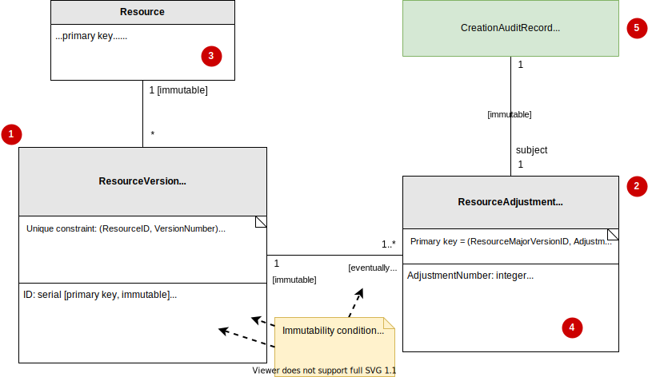

# The Reviewable concept: versioning, auditing & reviewing changes

The Reviewable concept is an approach that covers:

 - **Versioning**: recording all past versions of a resources.
 - **Auditing**: finding out why a resource changed, and who were responsible.
 - **Reviewing**: new changes are reviewed before they take effect.

These aspects are important for many resource types. You don't want ruleset changes to take effect until the change management board has reviewed them. If a production incident occurred, you want to be able to find out which change contributed to that problem, and why that change was made.

In diagrams, reviewable resources are annotated with "[reviewable]":

This document covers how this concept works, how it's used in diagrams, how it's implemented in the database and how it's implemented in the code.

## Versioning & the change process

Reviewable resources are _versioned_. Every change results in a new version. Old versions are not modified.

Creating a resource for the first time, or modifying an existing resource, doesn't happen in one step. It happens in multiple steps, accompanied by a review process. This is called the _change process_. Every step inside the change process is called a _subchange_.

When a change process begins, the system creates a new _major version_ of the resource. This major version starts in the "draft" review state, and has no version number (yet).

As part of the process, reviewers may approve or reject, or the author of the change may revise the contents or abandon the entire change process altogether. Each of these events is called a _subchange_. When a subchange happens, the system does not modify the existing version object. Instead, it creates a new _minor version_ of the resource, representing the most up-to-date contents and review state.

The change process ends upon approval. When this happens, a version number is assigned to the major version object. This version number is _mutable_: it's assigned to the existing major version in-place: no new major version object is created.

You can compare this change process with software development pull requests:

 * Starting the change process is like opening a pull request. This is anologous to starting a change process. The pull request is anologous to the major version object.
 * You revise the pull request's code by adding more commits. This is a subchange. Commits are analogous to creating new minor version objects, containing the new code trees.
 * When a reviewer comments with "I approve" or "I reject", then this is also a subchange. The comment is analogous to creating a new minor version object, containing the new review state.
 * When a reviewer approves, a bot automatically merges the pull request. This event is also considered a subchange. The event is analogous to ending the change process, assigning a major version number to the major version object.

## Major and minor versions

A major version represents a change process. A minor version represents a change inside the change process.

A change begins as a draft. It may be revised, abandoned and/or reviewed multiple times, until it's finally approved. Each such individual subchange may be done by a different person. In order to keep track of all this history, we split versions in two levels: major and minor.

 * A major version represents the change process itself.
 * Minor versions describe the editing history of a major version. They represent each subchange.

A major version object contains very little information. It mainly exists to group minor versions together. The minor version object stores most information:

 * The full resource contents.
 * The review state and potential comments.
 * If the resource is [disableable](disableable-resources.md): the enable state and potential comments.
 * The author who made this change.

### Version object immutability

> See also: [The Immutability concept](immutability.md)

A major version is initially partially immutable, eventually fully immutable, and has eventually fully immutable relationships:

 * When a major version is not yet approved, its version number is null. In this state it's partially immutable: all fields besides `VersionNumber` are immutable.

 * When a major version is approved, its version number becomes permanently non-null. In this state:

     - It's fully immutable.
     - It has fully immutable relationships. No more minor versions may be added.

Minor versions are always fully immutable, and always have fully immutable relationships.

### Version numbers

Both major and minor version objects' numbers are mononotically increasing, starting from 1.

Minor version numbers are always non-null.

A major version's number may be null. Being null indicates that the corresponding change process is not finalized. Being non-null indicates that the change process *is* finalized.

## Versioning infrastructure & database implementation

### Common case

A Reviewable resource is usually displayed in diagrams through its _simple notation_, with all its infrastructure hidden:

The simple notation actually represents the following infrastructure:

Highlights:

 * (1): A Resource is backed by one or more major versions.
 * (2): Each major version is backed by one or more minor versions.
 * (3) and (4): The Resource's primary key, as well as its non-versioned fields, are located in the Resource itself. However, its versioned fields live in the minor version object instead.
 * (5) Each minor version has exactly one CreationAuditRecord. This keeps track of who made this subchange.

### Interaction with the Undeletable or Disableable concepts

Suppose that a Reviewable resource is Undeletable or Disableable, like this:

Here's what it means for the underlying infrastructure:

Here are the changes compared to the common case:

 1. The Resource itself is always undeletable, even if the simple notation says its disableable.
 2. The major version resource is always undeletable (instead of eventually undeletable).
 3. If the Resource is disableable in its simple notation, then the minor version resource is disableable. Otherwise, the minor version resource is undeletable, with the same undeleteable scope that Resource has.

Note that if the Resource is disableable, then _enabling/disabling the resource results in a new minor version_. This is because the immutability property also extends to the disableable concept's implicit `Enabled` flag.

## Assocations

TODO: what happens if the simple notation has associations? there are two possibilities: associations on the Resource itself, or associations on the minor version (which means associations are also versioned).

## Implementation

TODO: document highlights in our implementation such as IReviewable
